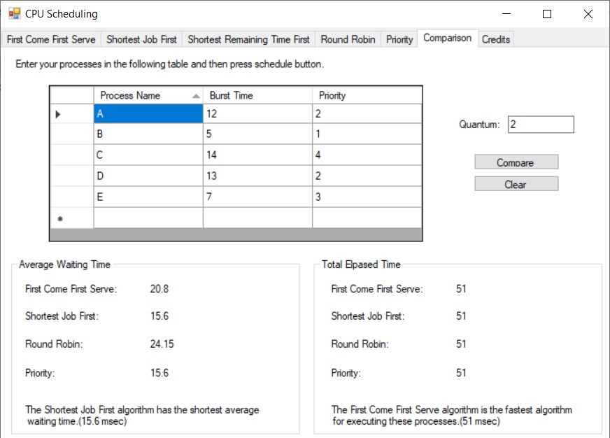
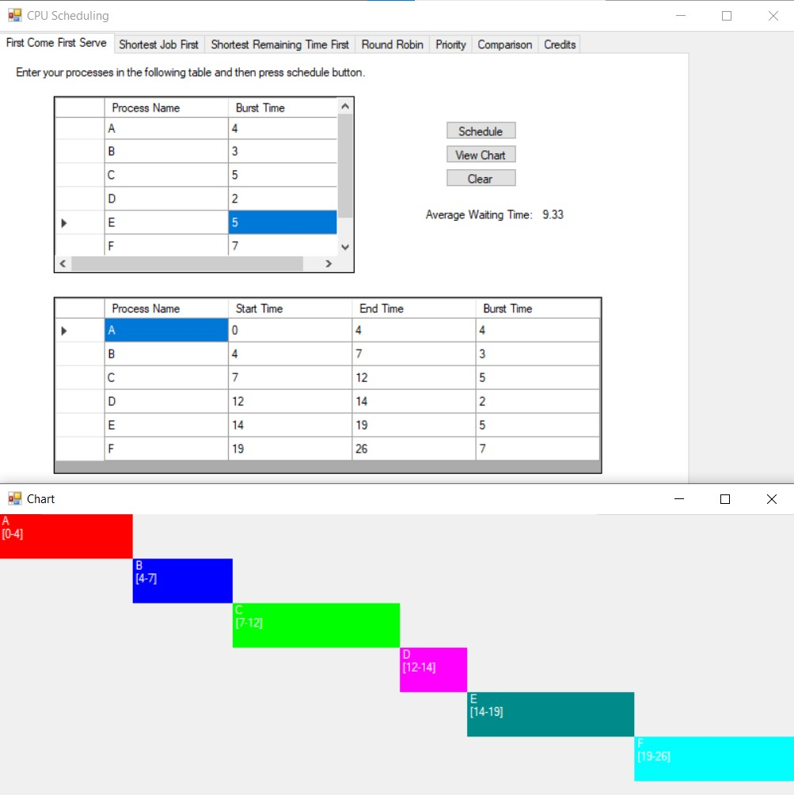

## CPU Scheduling Algorithms
This project performs scheduling on a series of processes using several scheduling algorithms. It can also illustrate a gantt chart to show the sequence of running those processes. In addition, the program can compare the results of running different scheduling algorithms, and suggest the best one for the process set.

**Supported Scheduling Algorithms:**
 * First Come First Serve (FSFC)
 * Shortest Job First (SJF)
 * Shortest Remaining Time First (SRTF)
 * Round Robin (RR)
 * Priority

